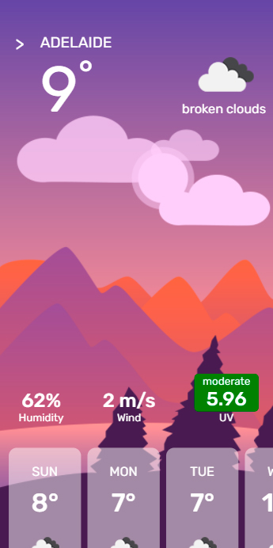
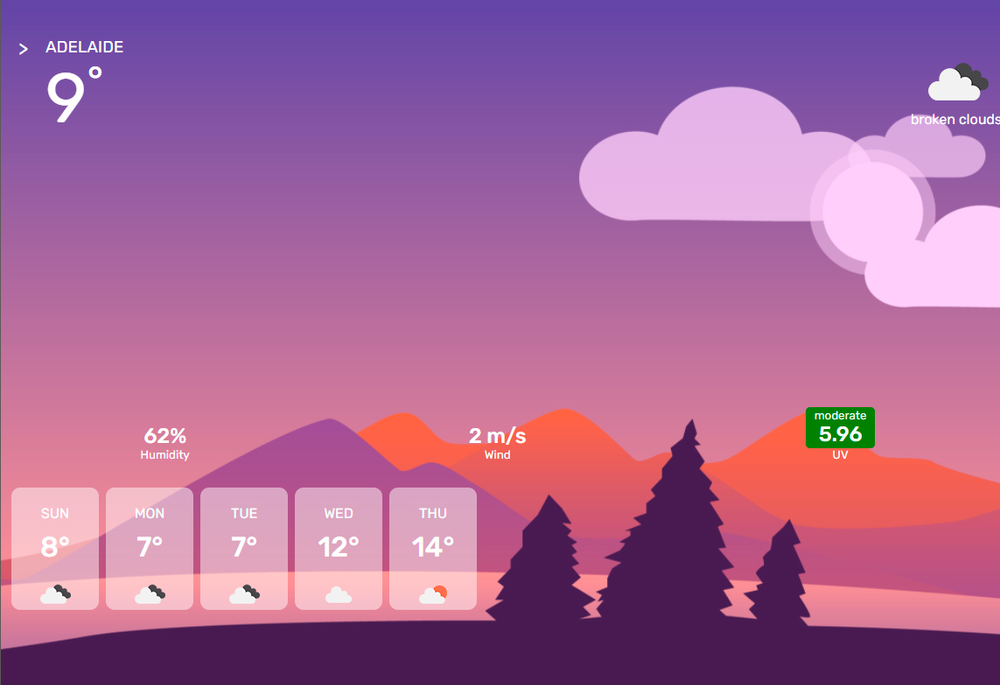
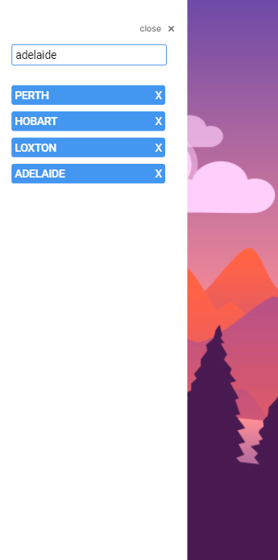
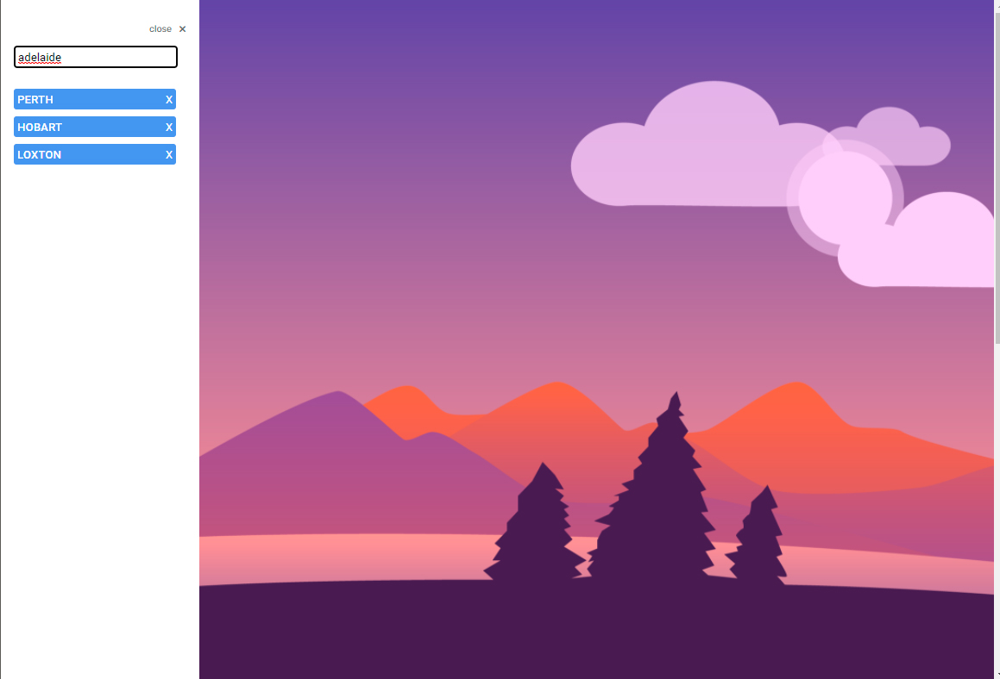

# Weather Dashboard

## features
-custom illustrations\
-users can search for a city and return the current weather conditions and the forcast for the next 5 days\
-previous searches are saved in local storage and rendered to the page as buttons, which can also be removed\
-weather data retrieved using openweathermap api
## how it works
when the page loads an api call is made to fetch the weather data for the most recent city search and the information is rendered to the page.\
when the user searches for a city an api call is made, the information is rendered to the page and the users search is saved a button which is also saved in local storage.

 
